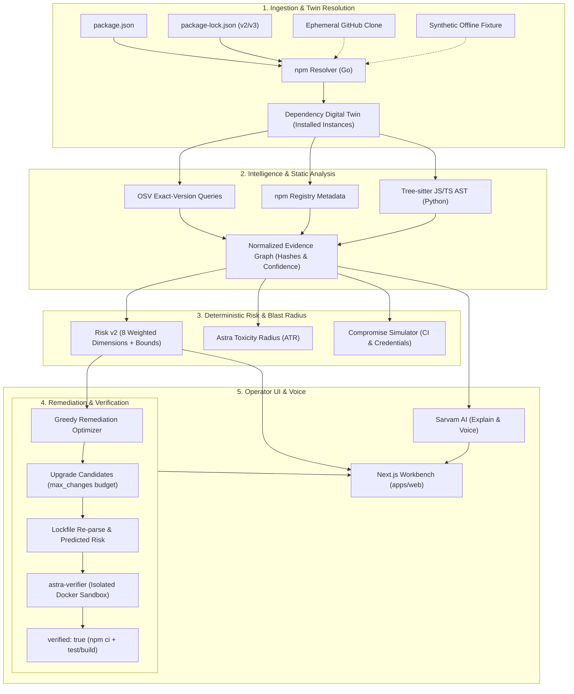

# ASTRA

**Autonomous Software Trust & Risk Analyzer**

> *Trace every dependency. Simulate every risk. Ship only what you trust.*

Astra is a software supply-chain security platform built around an installed dependency digital twin, deterministic risk scoring, attack compromise simulation, and verified remediation planning.

Unlike conventional vulnerability scanners that emit flat, unweighted CVE lists or rely on probabilistic AI hallucinations for security triage, Astra enforces a strict architectural boundary: **all vulnerability resolution, reachability tracking, risk scoring, attack simulation, and remediation optimization are 100% deterministic and grounded in cryptographic evidence.** Optional AI integrations (Sarvam) are strictly confined to presentation—multilingual explanations and voice interaction—operating on sanitized, allowlisted fact cards.

---

## Table of Contents

- [Core Workflows & Architecture](#core-workflows--architecture)
  - [Workflow 1: Ingestion & Digital Twin Resolution](#workflow-1-ingestion--digital-twin-resolution)
  - [Workflow 2: Multi-Source Intelligence Enrichment](#workflow-2-multi-source-intelligence-enrichment)
  - [Workflow 3: Static AST Reachability & Behavioral Observation](#workflow-3-static-ast-reachability--behavioral-observation)
  - [Workflow 4: Deterministic Risk Scoring & Compromise Simulation](#workflow-4-deterministic-risk-scoring--compromise-simulation)
  - [Workflow 5: Remediation Optimization & Sandboxed Verification](#workflow-5-remediation-optimization--sandboxed-verification)
- [Operator Investigation Workflow (Web UI)](#operator-investigation-workflow-web-ui)
- [System Architecture & Boundaries](#system-architecture--boundaries)
- [Operator Runbook (Docker Compose)](#operator-runbook-docker-compose)
- [Local Development Setup](#local-development-setup)
- [Complete API & Integration Workflow](#complete-api--integration-workflow)
- [Verification, Testing & CI Commands](#verification-testing--ci-commands)
- [Repository Map](#repository-map)
- [Security Invariants & Non-Goals](#security-invariants--non-goals)

---

## Core Workflows & Architecture

The following diagram illustrates Astra's end-to-end dataflow across services:



---

### Workflow 1: Ingestion & Digital Twin Resolution

Astra models software projects as a **Dependency Digital Twin** that mirrors the exact directory topology created by package managers on disk.

1. **Lockfile Support**: Strictly parses **npm lockfile version 2 and version 3** alongside `package.json`. Lockfile v1 and unpinned manifests are not supported.
2. **Instance Identity Preservation**:
   - `purl` identifies a package version (e.g. `pkg:npm/%40scope/pkg@1.0.0`).
   - `id` identifies a discrete installed instance path (e.g. `node_modules/a/node_modules/b`).
   - Distinct nested installations are never collapsed. Even if two packages share the exact same version, their parents, depth, and reachability context differ.
3. **Ingestion Channels**:
   - **Inline Lockfile**: Submit `package.json`, `package-lock.json`, and optional source files directly over HTTP.
   - **Client-Side ZIP**: The Next.js web application unpacks project archives in the browser and sends extracted manifests and sources to Core.
   - **Ephemeral GitHub Clone** (Requires `ASTRA_ENABLE_GITHUB=true`): Performs a shallow bare Git clone with blob filtering. Symlinks and submodules are skipped. Git credential helpers and hooks are disabled. The clone is deleted immediately after manifest extraction.
   - **Offline Demo**: Deterministic synthetic fixture (`source: "demo"`) for zero-network testing and verification.

---

### Workflow 2: Multi-Source Intelligence Enrichment

Once the dependency tree is constructed, Astra queries external providers concurrently with bounded timeouts and retries:

1. **OSV Exact-Version Matching**: Queries OSV using exact package versions (`name` + `version`), follows pagination, and attributes fixed versions.
2. **npm Registry Profiling**: Gathers publish dates, maintainer changes between adjacent releases, major/minor version gaps, and declared lifecycle scripts.
3. **Missing Evidence As Unknown**:
   - When an upstream API times out or fails, Astra marks that dimension as `null` or unknown.
   - Provider outages never default to zero risk or clean vulnerability status.
   - Every finding preserves source URLs, JSON pointers, and SHA-256 hashes.

---

### Workflow 3: Static AST Reachability & Behavioral Observation

Astra replaces naive keyword searches with static AST parsing:

1. **Tree-sitter JS/TS Analysis**: Parses project JavaScript, JSX, TypeScript, and TSX files in `src/` and `app/`.
2. **Syntactic Import Tracking**: Records file and line hashes for ES module imports, dynamic `import()`, CommonJS `require()`, and re-exports.
3. **Reachability Levels**:
   - **Level 0 (Unknown)**: No source provided or unresolved module.
   - **Level 1 (Lexical)**: Legacy string match observation.
   - **Level 2 (Module Observed)**: Verified syntactic AST import linking project source code to the root-installed package instance.
   - **Levels 3–4 (Reserved)**: Symbol-level execution and runtime call-graph paths (unproven in current increment).
4. **Static Capability Inspection**: Parses npm lifecycle scripts (`preinstall`, `postinstall`, `build`) for shell invocations, network requests, environment variable reads, and filesystem modifications. Script files are not executed during scanning.

---

### Workflow 4: Deterministic Risk Scoring & Compromise Simulation

Astra computes transparent, verifiable risk metrics without black-box models:

#### Risk Model (`risk-v2`)
Evaluates eight weighted dimensions with explicit priors (50/100) and confidence bounds:

| Dimension | Weight | Current Evidence Basis |
|---|---:|---|
| **Vulnerability** | 25% | Maximum normalized advisory severity. Unknown severity defaults to 50. |
| **Reachability** | 20% | Level 2 (`module_observed`) = 55; Level 1 = 35; Level 0 (unknown) = 50 prior. |
| **Behavior** | 15% | Static lifecycle script capabilities (network, shell, env access). |
| **Maintainer** | 10% | Maintainer turnover and major version jumps between adjacent releases. |
| **Maintenance** | 10% | Major/minor version gaps and unmaintained releases (>730 days). |
| **Concentration** | 10% | Largest current shared-maintainer share of installed instances. |
| **License** | 5% | Explicit SPDX table conflict against project license or denied licenses. |
| **Centrality** | 5% | Ratio of unique reverse dependency ancestors across the tree. |

- **Confidence & Bounds**: Computes `lower_bound` (assuming unknowns are clean) and `upper_bound` (assuming unknowns are malicious). Evidence confidence reflects observed coverage multiplied by provider evidence confidence.
- **Repository Trust**: `Trust = 100 - Risk`.

#### Experimental Astra Toxicity Radius (ATR)
Measures the blast radius of a compromised package using graph centrality, ancestor counts, CI exposure, and script capabilities:

$$\text{centrality factor} = 1 + \frac{\text{non-root ancestors}}{\text{installed instances}}$$
$$\text{ATR} = \text{round}\left(100 \times \left(1 - \exp\left(-\frac{\prod \text{factors}}{10}\right)\right)\right)$$

#### Attack Compromise Simulation
Simulates what happens if a specific installed package instance is hijacked:
- Evaluates reverse dependency traversal to find all affected upstream components.
- Models credential theft under configurable CI assumptions (`ci_install: true`, `lifecycle_scripts_enabled: true`).
- Restricts credentials to categories (`repository_token`, `cloud_credentials`, `database`), never secret values.

---

### Workflow 5: Remediation Optimization & Sandboxed Verification

1. **Greedy Remediation Optimizer**:
   - Takes a user change budget (`max_changes`, e.g. 3).
   - Prioritizes exact fixed versions from advisories and latest stable releases.
   - Evaluates upgrade cost: `1 + major-version penalty + direct/transitive effort penalty`.
2. **Lockfile Re-parse & Predicted Risk**:
   - Core applies version bumps to a copy of `package-lock.json`.
   - Re-resolves instances and re-computes `predicted_risk`.
   - Leaves predicted risk null if bumps introduce unpinned or conflicting trees.
3. **Isolated Verifier (`astra-verifier`)**:
   - A dedicated worker unpacks project files into a temporary sandbox.
   - Executes `npm ci --ignore-scripts` inside an unprivileged Docker container (`uid 1000`, read-only root).
   - Executes project-declared `test` and `build` scripts with **outbound networking disabled**.
   - Sets `verified: true` only if all sandbox checks pass. This proves build/test compatibility—not an absolute guarantee of exploit immunity.

---

## Operator Investigation Workflow (Web UI)

The web dashboard (`apps/web`) is a Next.js App Router application built on the Astra editorial design system:

```
┌────────────────────────────────────────────────────────────────────────┐
│  ASTRA WORKBENCH        [● Live Status]   [Hold to Talk (Sarvam Voice)]│
├────────────────────────────────────────────────────────────────────────┤
│                                                                        │
│   [Overview]       [Graph]       [Attack]     [Timeline]  [Remediate] │
│                                                                        │
│  ┌─────────────────────────────┐  ┌─────────────────────────────────┐ │
│  │ Trust Score: 84 / 100       │  │ Goal Detection Summary          │ │
│  │ Lower: 78    Upper: 92      │  │ • 14 Direct Dependencies        │ │
│  │ Evidence Confidence: 0.89   │  │ • 3 Vulnerabilities (1 Reachable)│ │
│  └─────────────────────────────┘  └─────────────────────────────────┘ │
│                                                                        │
│  [Dependency Graph View]                                               │
│  • Visualizes nested vs hoisted instances                              │
│  • Interactive node selection loads exact evidence drawer             │
│                                                                        │
│  [Compromise Simulation View]                                          │
│  • Select package -> Toggle CI credentials -> View Blast Radius       │
│                                                                        │
│  [Remediation Studio]                                                  │
│  • Upgrade candidates -> View predicted risk -> Upload ZIP to verify   │
└────────────────────────────────────────────────────────────────────────┘
```

1. **Dashboard Home (`/`)**: Submit scans via inline lockfile/manifest, repository URL, or synthetic demo. Inspect real-time scan statuses.
2. **Overview (`/scans/[id]`)**: Review project trust score, confidence bounds, goal metrics, license audit flags, and critical findings.
3. **Graph Explorer (`/scans/[id]/graph`)**: Interactively explore the dependency digital twin, filter by depth, and inspect cryptographic evidence records.
4. **Attack Simulator (`/scans/[id]/attack`)**: Run hypothetical compromise simulations to evaluate reverse dependency blast radius and credential theft vectors.
5. **Event Timeline (`/scans/[id]/timeline`)**: Audit full Server-Sent Events (SSE) transition logs with reconnect and replay support.
6. **Remediation Studio (`/scans/[id]/remediate`)**: Adjust upgrade budgets, review candidate version bumps with predicted risk, and trigger isolated verification.
7. **Multimodal Voice & AI Assistant**:
   - Hold-to-talk magenta button streams audio to Sarvam STT.
   - Deterministic client-side parser routes navigation and action commands without model hallucinations.
   - Structured fact cards provide localized voice and text explanations (Hindi, English, etc.) without exposing source code.

---

## System Architecture & Boundaries

| Service | Language & Stack | Port | Responsibilities & Boundaries |
|---|---|---|---|
| **Core API** | Go 1.24+ | `8080` | Public API, lockfile resolution, OSV/npm adapters, SSE streaming, PostgreSQL persistence. |
| **Intelligence** | Python 3.12+ (uv) | `8000` | Tree-sitter AST reachability, risk v2, ATR calculation, greedy remediation optimizer. |
| **Workbench** | Next.js 15, Tailwind v4 | `3000` | Operator dashboard, interactive graph, audio capture, proxy for private API credentials. |
| **Verifier** | Go + Docker Engine | Internal | Dedicated verify worker. Mounts Docker socket to run sandboxed container tests. |
| **Storage** | PostgreSQL 16 | `5432` | JSONB scan snapshots and monotonic event streams. (Memory storage for local dev). |
| **Interpreter** | Sarvam AI (External) | HTTPS | Optional audio transcription, speech synthesis, and structured evidence translation. |

---

## Operator Runbook (Docker Compose)

Production for Astra is **one trusted operator deployment** (`ASTRA_API_TOKEN`), not multi-tenant SaaS.

### 1. Configuration
Copy the environment template and configure secure credentials:

```sh
cp .env.example .env
```

Set credentials in `.env`:
```ini
POSTGRES_USER=astra
POSTGRES_PASSWORD=choose_a_secure_password
POSTGRES_DB=astra
ASTRA_INTERNAL_TOKEN=internal_secret_between_core_and_intelligence
ASTRA_API_TOKEN=operator_bearer_token_for_api
SARVAM_API_KEY=optional_sarvam_key_for_voice_and_translation
ASTRA_ENABLE_GITHUB=false
```

### 2. Launch Stack
Start the complete containerized stack:

```sh
docker compose --env-file .env -f infra/compose.yaml up --build
```

- **Investigation Workbench:** `http://127.0.0.1:3000`
- **Core API:** `http://127.0.0.1:8080`
- **Internal Intelligence:** Private Compose network only (`http://intelligence:8000`)

### 3. Crash Recovery & Retention
- Completed and partial PostgreSQL snapshots survive a Core restart.
- Scans still `queued` or `running` during an unexpected shutdown are marked **failed** on restart with an actionable resubmit message (raw inputs are never stored unencrypted).
- Core automatically prunes completed and failed snapshots older than `ASTRA_SCAN_RETENTION_AGE` (default `720h` / 30 days) or beyond `ASTRA_SCAN_RETENTION_COUNT` (default `500`).

---

## Local Development Setup

### Prerequisites
- **Go**: 1.24 or higher
- **Python**: 3.12 or higher with [uv](https://docs.astral.sh/uv/) installed
- **Node.js**: 20.x or higher with npm
- **Docker**: Optional (required only for isolated `astra-verifier` runs)

### Setup & Build
```sh
# 1. Install all dependencies across services
make setup

# 2. Run all unit and integration test suites
make test

# 3. Run all linters (go vet, ruff, eslint, typecheck)
make lint

# 4. Build standalone binaries and Next.js production bundle
make build
```

### Running Services Locally
Start each service in dedicated terminal tabs:

```sh
# Terminal 1: Intelligence Engine (Port 8000)
make intelligence

# Terminal 2: Core API (Port 8080)
make core

# Terminal 3: Web Dashboard (Port 3000)
make web
```

The web dashboard proxies requests to `http://127.0.0.1:8080/api/v1` automatically.

---

## Complete API & Integration Workflow

### 1. Submit a Scan
Submit an offline demo scan:
```sh
curl -sS -X POST http://127.0.0.1:8080/api/v1/scans \
  -H "Authorization: Bearer $ASTRA_API_TOKEN" \
  -H "Content-Type: application/json" \
  -d '{"source": "demo", "denied_licenses": ["GPL-3.0-only"]}'
```

Or submit an inline lockfile with optional source code:
```sh
curl -sS -X POST http://127.0.0.1:8080/api/v1/scans \
  -H "Authorization: Bearer $ASTRA_API_TOKEN" \
  -H "Content-Type: application/json" \
  -d '{
    "source": "lockfile",
    "manifest": {"name": "sample", "dependencies": {"lodash": "4.17.19"}},
    "lockfile": {
      "lockfileVersion": 3,
      "packages": {
        "": {"name": "sample", "dependencies": {"lodash": "4.17.19"}},
        "node_modules/lodash": {"version": "4.17.19", "license": "MIT"}
      }
    },
    "sources": {
      "src/index.ts": "import lodash from \"lodash\"; console.log(lodash);"
    }
  }'
```

Response (`202 Accepted`):
```json
{
  "scan_id": "as_01HX...",
  "status": "queued",
  "events_url": "/api/v1/scans/as_01HX.../events"
}
```

### 2. Stream Real-Time Progress
Stream stage events via SSE (supports `Last-Event-ID` replay):
```sh
curl -N -H "Authorization: Bearer $ASTRA_API_TOKEN" \
  http://127.0.0.1:8080/api/v1/scans/SCAN_ID/events
```

### 3. Query Graph, Findings & Evidence
```sh
# Fetch dependency twin (packages, versions, instances, edges)
curl -sS -H "Authorization: Bearer $ASTRA_API_TOKEN" \
  http://127.0.0.1:8080/api/v1/scans/SCAN_ID/graph

# Fetch deterministic risk findings and goal summary
curl -sS -H "Authorization: Bearer $ASTRA_API_TOKEN" \
  http://127.0.0.1:8080/api/v1/scans/SCAN_ID/findings

# Fetch cryptographic evidence records
curl -sS -H "Authorization: Bearer $ASTRA_API_TOKEN" \
  http://127.0.0.1:8080/api/v1/scans/SCAN_ID/evidence
```

### 4. Run Compromise Simulation
Simulate attack propagation and credential theft:
```sh
curl -sS -X POST http://127.0.0.1:8080/api/v1/scans/SCAN_ID/simulate \
  -H "Authorization: Bearer $ASTRA_API_TOKEN" \
  -H "Content-Type: application/json" \
  -d '{
    "package_id": "pkg_instance_id_from_graph",
    "ci_install": true,
    "lifecycle_scripts_enabled": true,
    "credential_categories": ["repository_token", "cloud_credentials"]
  }'
```

### 5. Generate Remediation Proposals
Request an optimized upgrade proposal within a change budget:
```sh
curl -sS -X POST http://127.0.0.1:8080/api/v1/scans/SCAN_ID/remediation \
  -H "Authorization: Bearer $ASTRA_API_TOKEN" \
  -H "Content-Type: application/json" \
  -d '{"max_changes": 3}'
```

### 6. Verify Upgrades in Isolated Sandbox
Submit the project archive (ZIP up to 8 MiB) to execute test/build in an isolated container:
```sh
curl -sS -X POST http://127.0.0.1:8080/api/v1/scans/SCAN_ID/verify \
  -H "Authorization: Bearer $ASTRA_API_TOKEN" \
  -F "max_changes=3" \
  -F "project=@project.zip;type=application/zip"
```

### 7. AI Evidence Explanation (Optional)
Obtain a structured, localized explanation using Sarvam AI:
```sh
curl -sS -X POST http://127.0.0.1:8080/api/v1/scans/SCAN_ID/explain \
  -H "Authorization: Bearer $ASTRA_API_TOKEN" \
  -H "Content-Type: application/json" \
  -d '{
    "package_id": "pkg_instance_id_from_graph",
    "language": "hi",
    "use_ai": true
  }'
```

---

## Verification, Testing & CI Commands

Astra enforces strict test rigor across Go, Python, and TypeScript:

```sh
# 1. Run all unit and integration tests
make test

# 2. End-to-end smoke test (Offline fixture through live Go & Python APIs)
make smoke

# 3. PostgreSQL persistence & crash recovery smoke test
make smoke-postgres

# 4. Opt-in live provider enrichment test (npm + OSV)
python3 scripts/smoke.py --postgres --live

# 5. Export JSON schemas and OpenAPI contracts
make schemas
```

---

## Repository Map

```text
apps/web/                        Next.js App Router investigation UI (design.md)
├── app/scans/[id]/              Overview, Graph, Attack, Timeline, Remediate
├── components/                  Design system UI primitives and voice widgets
└── lib/                         API client, SSE handler, and voice command parser

services/core/                   Go API & Ingestion Coordinator
├── cmd/astra/                   API service entrypoint and graceful shutdown
├── cmd/astra-verifier/          Isolated sandbox verification worker
├── internal/api/                HTTP resources, SSE streaming, rate/queue admission
├── internal/resolver/           Instance-preserving npm lockfile resolver
├── internal/registry/           npm and OSV API client adapters
├── internal/git/                Bounded ephemeral GitHub tree ingestion
├── internal/sandbox/            Container isolation & verifier execution
└── internal/store/              PostgreSQL JSONB persistence & memory store

services/intelligence/           Python Deterministic Analysis Service
├── app/models.py                Strict Pydantic contract definitions
├── app/reachability/            Tree-sitter JS/TS lexical module analyzer
├── app/risk/                    Deterministic 8-factor risk scoring & ATR
├── app/optimizer/               Greedy remediation upgrade candidate solver
└── app/ai/                      Sarvam interpretation & allowlisted translation

infra/                           Deployment Configurations
├── compose.yaml                 Production operator multi-service stack
└── Dockerfile.*                 Hardened, non-root, read-only container definitions

docs/                            Technical Specifications & Standards
├── api.md                       Full HTTP REST and SSE specification
├── analysis.md                  Detailed risk formulas, ATR, and reachability levels
├── architecture.md              Boundaries, process isolation, and guarantees
└── verification.md              Historical test benchmarks and validation runs
```

---

## Security Invariants & Non-Goals

1. **AI Isolation**: AI never makes security decisions, computes risk scores, evaluates vulnerabilities, or selects remediation targets.
2. **Instance Identity**: Discrete package installations are never collapsed by package name or version alone.
3. **No Execution During Scan**: Static scanning strictly parses text and ASTs. Project lifecycle scripts are never executed on the host.
4. **Sandboxed Verification**: Verification runs only inside unprivileged, network-disabled containers via `astra-verifier`.
5. **Traceable Evidence IDs**: Every finding links directly to a verifiable evidence record containing source pointers, locations, and SHA-256 hashes.
6. **Unknowns Preserved**: Incomplete provider data produces explicit unknown ratings and wider confidence bounds, rather than falsely reporting clean dependencies.
7. **Verified != Safe**: `verified: true` confirms only that declared project tests/builds passed in the sandbox. It is not an absolute warranty against zero-days or runtime exploits.
