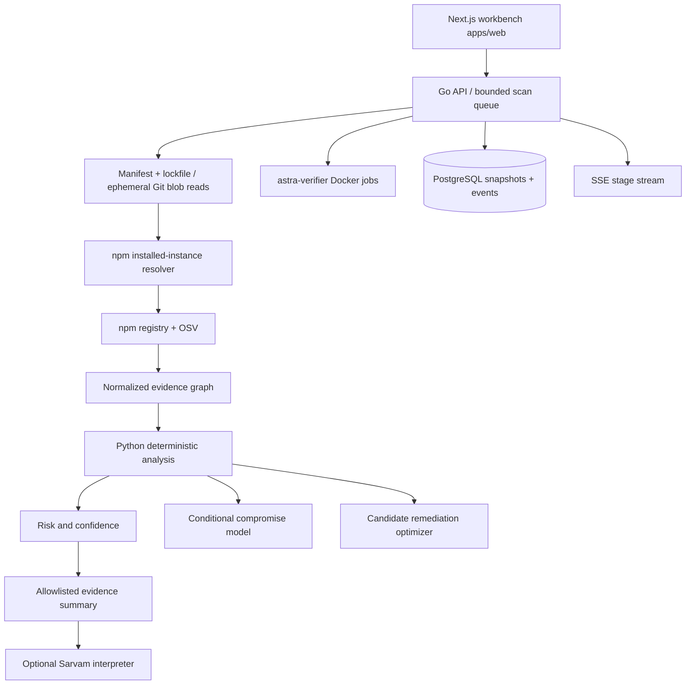

# Backend boundaries and delivery status

Go handles I/O concurrency and installed dependency resolution. Python handles analysis and optimization. Both use ordinary in-memory graph traversal; introducing a separate graph database or an optimizer framework is unnecessary before richer algorithms exist.

The migration lives at `services/core/internal/store/migration.sql` and is embedded in core. Scan snapshots are stored atomically as JSONB, including package instances, edges, findings, evidence, events, and the scan’s `package.json` / `package-lock.json` after analysis. Source bodies and GitHub tokens are not persisted. Public scan JSON omits stored lockfile and manifest. Vulnerability metadata and file/line references are persisted.

## Operator deployment

| Stack | Persistence | Workbench |
| --- | --- | --- |
| `docker compose --env-file .env -f infra/compose.yaml up` | PostgreSQL (`DATABASE_URL` built from `POSTGRES_PASSWORD`) | `http://127.0.0.1:3000` (`web` → `http://core:8080`) |
| `make intelligence`, `make core`, `make web` | Memory unless `DATABASE_URL` is set | `http://127.0.0.1:3000` → `127.0.0.1:8080` |

Operator production is the Compose row: postgres + intelligence + core + web, loopback ports only, `ASTRA_ENABLE_GITHUB=false` unless you accept the ingestion limits below. The memory store is laptop-only.

Core `/health` does not require a bearer token. `/ready` and investigation APIs do when `ASTRA_API_TOKEN` is set. The Next.js `/api/v1` proxy attaches that token from server env; it must not appear in browser bundles or query strings.

## Queue and recovery

There is one coordinator, two scan workers, and a bounded in-process queue. PostgreSQL advisory locking prevents normal concurrent coordinator startup. Completed and partial scans survive restarts. Because raw scan inputs are not stored, unfinished scans (`queued` or `running`) are marked failed during startup with a resubmit message. There is no durable retry queue, automatic repository re-fetch, Redis scheduling, or multi-replica support yet.

The memory store is a local development alternative, capped at 1,000 snapshots with no eviction; it is not an operator store. PostgreSQL pruning applies only to `completed`, `failed`, and `partial` snapshots: default max age `720h` (`ASTRA_SCAN_RETENTION_AGE`) and 500 newest (`ASTRA_SCAN_RETENTION_COUNT`). Limits of `0` disable that axis. `queued` and `running` are never deleted. Prune runs at coordinator startup and when a terminal snapshot is saved. The API is a trusted single-operator service with a shared bearer token; tenant ownership, OAuth/GitHub App authentication, audit log policy, billing, and organization permissions are not implemented.

## Repository ingestion

GitHub support is disabled by default. When enabled, core accepts only canonical public HTTPS GitHub repository URLs. It creates a temporary bare clone with shallow, blob-filtered fetching; reads regular file blobs; skips symlinks and submodules; and deletes the clone after extracting input. It does not check out files, install packages, run lifecycle hooks, or invoke project commands. Git configuration inheritance, credential helpers, file protocol, and HTTP redirects are disabled for these commands.

The Compose profile provides CPU, memory, process and temporary disk limits for the service. This is shared service-level isolation, **not per-scan worker isolation**. Git fetching still needs repository-wide metadata and network access. Remediation verification is a separate `astra-verifier` process that may mount the host Docker socket; core does not. Child verify containers drop capabilities, run as uid 1000, use a read-only root, and disable network for `test`/`build`. The verifier host is still a privileged boundary. Authenticated private-repository handling and tenant isolation are required before exposing ingestion to untrusted tenants. The local process mode has no container disk/CPU isolation unless the verifier is running.

## What is tested

Go tests cover nested/scoped resolution, optional dependencies and cycles, URL restrictions, registry outages, OSV pagination/fix attribution, state isolation, API auth/input rejection, SSE replay, and scan failure handling. The suite runs with the Go race detector. Python tests cover evidence references, risk determinism and bounds, unknown coverage, Tree-sitter JavaScript/TypeScript module observations, parser-error partial results, instance identity, conditional propagation, cycle handling, candidate selection, API validation and interpreter fallback.

The real service smoke test uses the synthetic fixture through the public API. With PostgreSQL enabled, it also tests interrupted-job recovery and snapshot durability across a core restart. Live npm/OSV requests are opt-in. A Sarvam live call requires an API key and is not part of deterministic tests. Docker builds need a Docker engine; native service tests do not verify container images.

## Investigation UI

The client is `apps/web` (Next.js operator dashboard). Design: `apps/web/design.md`. Home lists scans. Modes: Overview, Graph, Attack, Timeline, Remediate. Shared investigation query: `package` (install instance `id`) and `finding`. Graph uses `id` as the node key and `purl` for version identity; do not collapse instances. Timeline is scan SSE history, not maintainer history. `GET /api/v1/scans` feeds the live rail. `verified: true` is not a safety claim.

Compose serves the workbench on loopback `:3000`. `make web` is the laptop equivalent and still talks to core on `127.0.0.1:8080` by default. Remediation may include `predicted_risk` after a compatible lockfile bump. Isolated verification is optional and requires the verifier service plus a Docker engine.
